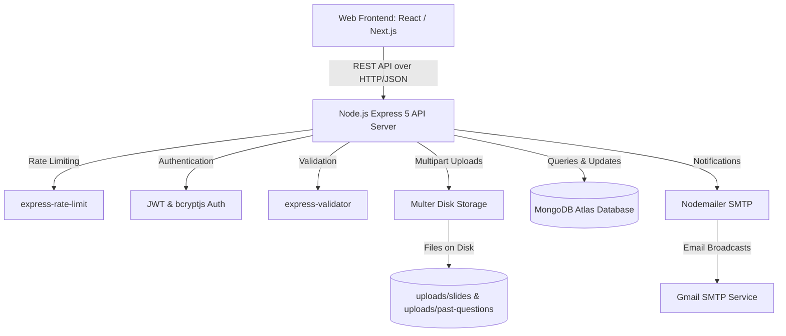

# System Overview: UEW School of Business Digital Library

## 1. Mission & Domain Background

The **UEW Digital Library Management System** is a dedicated academic resource repository for the **University of Education, Winneba (UEW) School of Business**. 

Its goal is to eliminate fragmented resource distribution across WhatsApp and Telegram groups by providing a centralized, secure, authenticated, and role-governed digital repository.

Students can browse lecture slides, past examination papers, leave star ratings and reviews, bookmark resources with personal study notes, and receive instant in-app and email notifications whenever new materials are published for their academic level.

---

## 2. Key User Personas

### 👨‍🎓 1. Student Persona
- **Registration**: Registers using university Student ID, university email, academic level (`L100` to `PHD`), and program of study.
- **Verification**: Verifies email address via secure token link before unrestricted access.
- **Resource Consumption**: Searches and filters slides and past questions by course, level, semester, and academic year.
- **Engagement**:
  - Downloads course materials.
  - Adds personal bookmarks with private study notes.
  - Leaves 1-to-5 star ratings and written reviews.
  - Marks peer reviews as helpful.
  - Manages in-app notification inbox and email alert preferences.

### 🛡️ 2. Admin / Department Staff Persona
- **Curricular Categorization**: Creates academic categories corresponding to courses (Course Code, Course Name, Level, Semester).
- **Resource Upload**:
  - Uploads single documents (up to 10MB; PDF, DOC, DOCX, PPT, PPTX).
  - Performs batch uploads (up to 10 files simultaneously) tied to a course category.
  - Automatic broadcast of notifications to all active students in the target academic level.
- **Resource Governance**: Deletes outdated or erroneous files from the system and disk.
- **User Administration**: Views all registered users, activates/deactivates accounts, edits profile roles.
- **Analytics & Reporting**:
  - Tracks total registered users, downloads, categories, and resources.
  - Views download distributions by academic level and material type.
  - Inspects individual user contribution and individual resource download metrics.

---

## 3. High-Level Technology Blueprint

