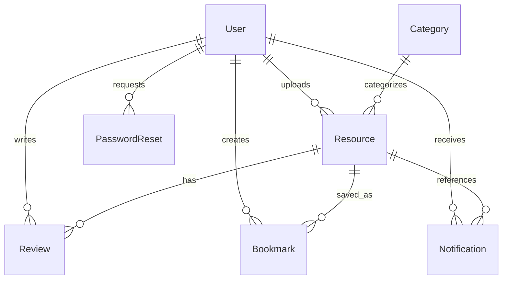

# Data Models & Schema Specification

The backend manages seven core Mongoose models in MongoDB.

---

## 1. Entity Relationship Diagram (ERD)

---

## 2. Models Detail

### 👤 `User` (`models/User.js`)
Stores authenticated user records (students and administrators).

| Field | Type | Attributes | Description |
|---|---|---|---|
| `studentId` | String | Required, Unique, Trim | Unique university identification number |
| `email` | String | Required, Unique, Lowercase, Trim | Institutional or personal email address |
| `password` | String | Required, Min: 6 | Bcrypt hashed password (salt factor 10) |
| `firstName` | String | Required, Trim | User's first name |
| `lastName` | String | Required, Trim | User's last name |
| `level` | String | Required, Enum | `['L100', 'L200', 'L300', 'L400', 'MASTERS', 'PHD']` |
| `program` | String | Required, Trim | Academic program (e.g., "BSc Accounting") |
| `role` | String | Enum, Default: `'student'` | `['student', 'admin']` |
| `isActive` | Boolean | Default: `true` | Account suspension flag |
| `isEmailVerified` | Boolean | Default: `false` | Whether email verification was completed |
| `emailVerificationToken` | String | Optional | 32-byte hex crypto token |
| `emailVerificationExpires` | Date | Optional | Expiration timestamp (24h from creation) |
| `preferences.emailNotifications` | Boolean | Default: `true` | General email delivery preference |
| `preferences.newResourceAlerts` | Boolean | Default: `true` | New material alert delivery preference |
| `timestamps` | Date | Automatic | `createdAt`, `updatedAt` |

---

### 📚 `Resource` (`models/Resource.js`)
Stores uploaded academic files and metadata.

| Field | Type | Attributes | Description |
|---|---|---|---|
| `title` | String | Required, Trim | Document title |
| `description` | String | Optional, Trim | Optional synopsis of document content |
| `type` | String | Required, Enum | `['SLIDE', 'PAST_QUESTION']` |
| `category` | ObjectId | Required, Ref: `'Category'` | Academic course association |
| `level` | String | Required, Enum | `['L100', 'L200', 'L300', 'L400', 'MASTERS', 'PHD']` |
| `fileName` | String | Required | Generated disk filename (`Date.now()-name`) |
| `filePath` | String | Required | Relative disk path (`uploads/slides/...`) |
| `fileSize` | Number | Required | Size in bytes |
| `uploadedBy` | ObjectId | Required, Ref: `'User'` | Admin/Uploader ID |
| `downloads` | Number | Default: `0` | Cumulative download counter |
| `academicYear` | String | Optional, Trim | Academic calendar year (e.g., "2024/2025") |
| `averageRating` | Number | Default: `0`, Min: 0, Max: 5 | Computed floating-point rating |
| `totalReviews` | Number | Default: `0` | Total number of published reviews |
| `tags` | [String] | Array of Strings | Search keywords |
| `timestamps` | Date | Automatic | `createdAt`, `updatedAt` |

---

### 🏷️ `Category` (`models/Category.js`)
Represents course curricula groupings.

| Field | Type | Attributes | Description |
|---|---|---|---|
| `name` | String | Required, Trim | Category descriptive title |
| `level` | String | Required, Enum | `['L100', 'L200', 'L300', 'L400', 'MASTERS', 'PHD']` |
| `courseCode` | String | Required, Trim | e.g., `"BSM111"`, `"ACC201"` |
| `courseName` | String | Required, Trim | e.g., `"Principles of Management"` |
| `semester` | String | Required, Enum | `['FIRST', 'SECOND']` |
| `timestamps` | Date | Automatic | `createdAt`, `updatedAt` |

---

### ⭐ `Review` (`models/Review.js`)
Resource ratings and textual feedback.

| Field | Type | Attributes | Description |
|---|---|---|---|
| `resource` | ObjectId | Required, Ref: `'Resource'` | Target resource |
| `user` | ObjectId | Required, Ref: `'User'` | Author student ID |
| `rating` | Number | Required, Min: 1, Max: 5 | Star score integer |
| `comment` | String | Optional, Max: 500 chars | Review comment |
| `helpful` | Number | Default: `0` | Upvote counter |
| `timestamps` | Date | Automatic | `createdAt`, `updatedAt` |

*Index: `{ resource: 1, user: 1 }` unique (one review per user per resource).*

---

### 🔖 `Bookmark` (`models/Bookmark.js`)
User saved resources with personal study notes.

| Field | Type | Attributes | Description |
|---|---|---|---|
| `user` | ObjectId | Required, Ref: `'User'` | User bookmarking |
| `resource` | ObjectId | Required, Ref: `'Resource'` | Saved resource |
| `notes` | String | Optional, Max: 500 chars | Personal revision / study notes |
| `timestamps` | Date | Automatic | `createdAt`, `updatedAt` |

*Index: `{ user: 1, resource: 1 }` unique (prevents duplicate saves).*

---

### 🔔 `Notification` (`models/Notification.js`)
In-app and email alert event log.

| Field | Type | Attributes | Description |
|---|---|---|---|
| `user` | ObjectId | Required, Ref: `'User'`, Index | Target recipient user |
| `type` | String | Enum, Default: `'GENERAL'` | `['NEW_RESOURCE', 'SYSTEM', 'UPDATE', 'GENERAL']` |
| `title` | String | Required, Trim | Notification headline |
| `message` | String | Required, Trim | Body explanation |
| `resource` | ObjectId | Optional, Ref: `'Resource'` | Related resource |
| `link` | String | Optional, Trim | Frontend navigation path |
| `isRead` | Boolean | Default: `false` | Read status |
| `timestamps` | Date | Automatic | `createdAt`, `updatedAt` |

*Compound Index: `{ user: 1, isRead: 1, createdAt: -1 }`.*

---

### 🔑 `PasswordReset` (`models/PasswordReset.js`)
Time-limited reset tokens.

| Field | Type | Attributes | Description |
|---|---|---|---|
| `user` | ObjectId | Required, Ref: `'User'` | Requesting user |
| `token` | String | Required | 32-byte hex crypto string |
| `expiresAt` | Date | Required, Default: 1 hour | Expiration timestamp |
| `used` | Boolean | Default: `false` | Single-use invalidation flag |
| `timestamps` | Date | Automatic | `createdAt`, `updatedAt` |
