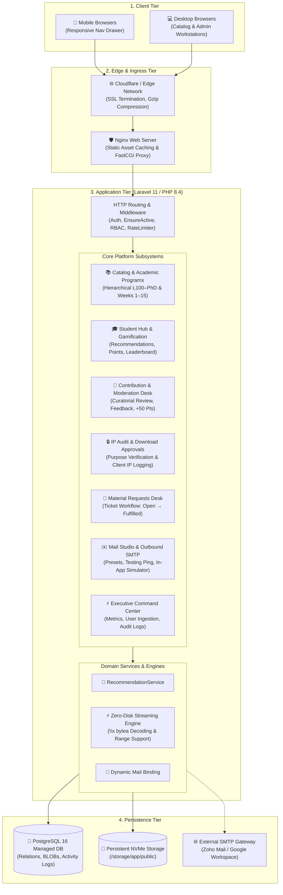
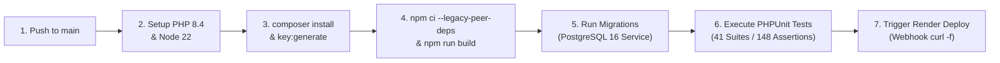

# UEW School of Business Digital Library Management System

[](https://www.php.net/)
[](https://laravel.com)
[](https://tailwindcss.com/)
[](https://alpinejs.dev/)
[](https://www.postgresql.org/)
[](https://render.com/)
[](https://github.com/mhiskall282/digital-library-management-system-backend/actions)

A mission-critical, enterprise-grade academic learning resource repository and digital library management platform engineered for the **University of Education, Winneba (UEW) — School of Business**. 

The system provides curated, level-gated access to lecture slide decks, syllabus modules, past examination papers, student contributions with gamification points, curatorial moderation, and institutional IP compliance auditing.

---

## 🏛️ System Architecture

The application adopts a high-performance Monolithic MVC pattern designed for zero-disk streaming, instant responsiveness, and seamless containerized cloud deployment.



---

## 📋 Comprehensive Feature Matrix

### 1. 🌐 Public Brand Landing Page (`/`)
- Public showcase introducing the digital repository to prospective students, faculty, and visiting scholars.
- Quick search jump-bar with instant query dispatch directly into the catalog.
- Real-time university metrics: Total Study Materials, Verified Downloads, Active Scholars, and Courses Offered.
- Public **Top Contributors Leaderboard** celebrating scholar engagement.

### 2. 🎓 Academic Programs & Level Directory (`/programs`)
Curriculum navigation grouped by official degree programs offered at the UEW School of Business:
- **BSc. Business Information Systems (BIS)**
- **BSc. Banking and Finance**
- **BSc. Accounting**
- **BBA. Marketing**
- **BBA. Human Resource Management**
- **BSc. Procurement & Supply Chain Management**
- **Postgraduate Studies (MBA, MPhil, PhD)**
- Dynamic tab drill-down across all academic levels: `L100`, `L200`, `L300`, `L400`, `MASTERS`, `PHD`.

### 3. 📅 Syllabus Week Grouping (Weeks 1 to 15)
- All lecture slides and revision notes are categorized by syllabus weeks (`Week 1` through `Week 15`), or marked as `General / Exam Archive`.
- Color-coded badges (`Week 4 Module`) for immediate curriculum orientation.
- Filter dropdown in the Catalog Explorer (`/dashboard`) allowing students to view lecture slides week by week.

### 4. ⚡ Binary BLOB & Compact Zero-Disk Streaming
- Uploaded files under 8MB are stored directly as binary blobs in the PostgreSQL database using native `bytea` format.
- Content is served with optimal HTTP caching headers (`Cache-Control: public, max-age=86400`, `Content-Disposition`, `Content-Length`), bypassing disk bottlenecks.
- Automatic fallback to persistent NVMe disk storage for files exceeding the binary threshold.

### 5. 📝 Student Contribution & Moderation Desk
- Enrolled students submit course materials via `/student/contribute`.
- Submissions enter `PENDING_REVIEW` and queue in the **Admin Moderation Desk** (`/admin/moderation`).
- Curators preview files in-browser, and can either **Approve** (publishing the document and awarding **+50 Contributor Points**) or **Reject** with actionable student feedback.

### 6. 🏆 Gamification, Points & Leaderboard
- Students accumulate Contributor Points for academic engagement:
  - Account Onboarding & Profile Completion: `+25 points`
  - Approved Study Material Submission: `+50 points`
  - Helpful Review on Course Notes: `+10 points`
- Automated Tiered Scholar Ranks:
  - `0 - 49 pts`: **Novice Contributor**
  - `50 - 149 pts`: **Scholar Contributor**
  - `150 - 299 pts`: **Top Contributor**
  - `300+ pts`: **Master Scholar**

### 7. 🔒 Intellectual Property (IP) Protection & Download Authorizations
- Controlled via `require_download_approval` in Administrative Settings.
- When enabled, students must provide an academic justification prior to downloading sensitive course papers.
- Curators review and authorize requests via `/admin/downloads`.
- Every download event records the student's IP address, browser user-agent, and timestamp in `activity_logs` for audit compliance.

### 8. 💬 Material & Support Requests Desk (`/requests`)
- Students submit requests for missing slides, lecture topics, or past questions.
- Curators track tickets across four statuses: `OPEN`, `IN_PROGRESS`, `FULFILLED`, and `CLOSED`.

### 9. 📢 Broadcast Announcements & Branded HTML Emails
- Administrators can broadcast announcements to **All Students**, by **Academic Level** (`L300`), or by **Degree Program** (`BIS`).
- Dispatched as real-time dashboard notifications and branded HTML emails.
- Official institutional templates:
  - `WelcomeActivationMail`: Initial student activation & credentials.
  - `SecurityAlertMail`: Password and security event notifications.
  - `AdminBroadcastMail`: Faculty announcements and exam notices.

### 10. ✉️ In-App Email Studio & Simulator (`/admin/mail-studio`)
- **Visual Template Inspector**: Responsive live preview of all 3 email templates.
- **Dual Delivery Modes**:
  - **⚡ In-App Simulator**: Instant zero-dependency delivery directly into the In-App Mailbox for local testing.
  - **🌐 Live SMTP**: Direct dispatch via Zoho Mail, Google Workspace, or custom SMTP server.
- **Inbound Message Simulation**: Simulate receiving incoming student replies without external IMAP subscriptions.

### 11. ⚙️ Dynamic SMTP Server Management (`/admin/settings`)
- Reconfigure outbound SMTP credentials directly in the administrative UI.
- Pre-configured presets for **Google Gmail / Workspace** (Port 587 TLS) and **Zoho Mail** (Port 465 SSL).
- Secure password masking: credentials are encrypted in the database and never exposed in HTML source.
- Live Connection Ping diagnostic tool to test SMTP handshakes on demand.

### 12. 📑 Bulk Student Ingestion (CSV / Excel)
- Batch-import student rosters via `/admin/users/import`.
- Generates cryptographically secure temporary passwords and un-onboarded student profiles.
- Automated email dispatch of activation links.
- Official sample CSV template download available at `/admin/users/import/sample`.

### 13. 📊 System Audit Logs & Compliance Reports (`/admin/reports`)
- Comprehensive audit trail of all platform events (Logins, Downloads, Submissions, Approvals, Broadcasts).
- Filter by action type, date range, or keywords.
- One-click **Export CSV Report** streaming audit logs for the Dean and University Academic Board.

### 14. 🛡️ Security Hardening & Zero Credential Leakage
- Hardened public login screen (`/login`) with zero exposed demo credentials.
- Inactive user kill-switch enforced by `EnsureActive` middleware.
- Full rate-limiting on sensitive authentication and download endpoints.
- Path traversal defense and MIME-type verification on binary file streams.

---

## 👥 Role-Based Access Control (RBAC)

The platform enforces a strictly partitioned 5-tier role hierarchy:

| Capability | Guest | Student | Lecturer | Staff | Admin | SuperAdmin |
|---|:---:|:---:|:---:|:---:|:---:|:---:|
| Browse Landing Page & Programs (`/programs`) | ✅ | ✅ | ✅ | ✅ | ✅ | ✅ |
| Access Public Docs (`/docs`) | ✅ | ✅ | ✅ | ✅ | ✅ | ✅ |
| Access Level-Gated Catalog (`/dashboard`) | ❌ | ✅ | ✅ | ✅ | ✅ | ✅ |
| Download Lecture Slides & Exams | ❌ | ✅ | ✅ | ✅ | ✅ | ✅ |
| Submit Materials for Review (`/student/contribute`) | ❌ | ✅ | ✅ | ✅ | ✅ | ✅ |
| Direct Unmoderated Publishing | ❌ | ❌ | ✅ | ✅ | ✅ | ✅ |
| Moderate Submissions (`/admin/moderation`) | ❌ | ❌ | ❌ | ✅ | ✅ | ✅ |
| Manage Download Approvals (`/admin/downloads`) | ❌ | ❌ | ❌ | ✅ | ✅ | ✅ |
| Send Targeted Broadcasts (`/admin/broadcasts`) | ❌ | ❌ | ❌ | ❌ | ✅ | ✅ |
| Configure Dynamic SMTP (`/admin/settings`) | ❌ | ❌ | ❌ | ❌ | ✅ | ✅ |
| Bulk CSV Ingestion (`/admin/users/import`) | ❌ | ❌ | ❌ | ❌ | ✅ | ✅ |

---

## 🎨 Design System & Visual Palette

The interface follows the official visual identity of the **University of Education, Winneba**:

| Token Name | Hex Code | Purpose |
|---|---|---|
| **UEW Scarlet** | `#C41E3A` | Primary brand accent, primary CTA buttons, active states, brand headers |
| **UEW Scarlet Hover** | `#A0182E` | Interactive hover and active button states |
| **UEW Ultramarine Navy** | `#1E3A8A` | Secondary brand header, course code badges, institutional borders |
| **UEW Deep Slate** | `#0F172A` | Hero backdrops, admin navigation drawer, high-contrast text |
| **Academic Amber** | `#F59E0B` | 5-star ratings, bookmark highlights, contributor point rewards |
| **Emerald Green** | `#10B981` | Verification badges, success indicators |
| **Surface Slate** | `#F8FAFC` | Page background providing clean, legible academic contrast |

**Typography**: Google Fonts — *Plus Jakarta Sans* (`300`, `400`, `500`, `600`, `700`, `800`, `900`).

---

## 🚀 Local Development Setup

Follow these steps to set up and run the system locally:

### 1. Prerequisites
- **PHP**: `>= 8.4` with `pdo_sqlite`, `pdo_pgsql`, `pgsql`, `mbstring`, `fileinfo`, `gd`, `zip`, `intl` extensions
- **Composer**: `>= 2.2`
- **Node.js**: `>= 20.19` or `>= 22.12` (Node 22 LTS recommended)
- **npm**: `>= 10.0`

### 2. Clone the Repository
```bash
git clone https://github.com/mhiskall282/digital-library-management-system-backend.git
cd digital-library-management-system-backend
```

### 3. Install Dependencies
```bash
# Install PHP dependencies
composer install --prefer-dist

# Install Node dependencies (uses .npmrc legacy-peer-deps configuration)
npm ci --legacy-peer-deps
```

### 4. Configure Environment
```bash
# Copy sample configuration
cp .env.example .env

# Generate unique application encryption key
php artisan key:generate
```

### 5. Initialize the Database
```bash
# Run all migrations and seed demo institutional data
php artisan migrate:fresh --seed
```

### 6. Build Frontend Assets
```bash
# Compile Tailwind CSS v4 and Alpine.js for production
npm run build

# Or launch the Vite hot-reloading development server
npm run dev
```

### 7. Launch Local Web Server
```bash
php artisan serve --port=8000
```
Open your browser at `http://127.0.0.1:8000`.

---

## 🧪 Automated Testing

The repository contains an exhaustive automated test suite written using PHPUnit:

```bash
# Run all feature and unit test suites
php artisan test
```

### Test Suite Highlights
- **41 Tests, 148 Assertions, 0 Failures**
- Comprehensive test coverage:
  - Institutional healthcheck (`/health`)
  - Public landing page & academic programs directory
  - Hardened login screen & credential leakage defense
  - Student authentication, registration & onboarding
  - Catalog filtering (by program, level, and syllabus week)
  - Student material contributions & curatorial moderation
  - Contributor point awarding & leaderboard calculation
  - Download approval authorization & IP audit logging
  - Material request desk ticket lifecycles
  - Email Studio live dispatch & in-app simulation
  - System settings dynamic SMTP binding & test connection ping
  - Institutional CSV export & audit trails

---

## 🔄 CI/CD Pipeline (GitHub Actions)

The platform runs a continuous integration and deployment pipeline defined in [`.github/workflows/deploy.yml`](.github/workflows/deploy.yml):



### CI/CD Specifications
- **Runner**: `ubuntu-latest`
- **PHP Version**: `8.4` (with `pdo_pgsql`, `pgsql`, `pdo_sqlite`, `sqlite3`, `intl`, `gd`, `zip`)
- **Node Version**: `22` (LTS)
- **Database Service**: `postgres:16-alpine` service container with automated healthchecks
- **Deploy Trigger**: Calls the Render deploy hook on successful builds on `main`.

---

## ☁️ Production Deployment (Render)

This repository includes a turnkey **Render Blueprint** ([`render.yaml`](render.yaml)):

### Infrastructure Components
1. **Web Service**:
   - Built from [`deploy/Dockerfile`](deploy/Dockerfile) using a multi-stage Alpine build.
   - Includes **Nginx 1.26**, **PHP-FPM 8.4**, and **Supervisor** for process management.
2. **Managed Database**:
   - Dedicated **PostgreSQL 16** managed instance with automatic daily backups.
3. **Persistent Volume**:
   - 10GB NVMe storage mounted at `/var/www/html/storage/app/public` ensuring uploaded study files persist across container redeployments.

---

## 📚 Technical Documentation Index

For in-depth architectural and operational guides, refer to the [`docs/`](docs/) directory:

- [🏛️ System Architecture Overview](docs/ARCHITECTURE.md) — Comprehensive component diagrams, domain services, and streaming engine.
- [🗄️ Database Schema & ERD](docs/DATABASE_SCHEMA.md) — Complete 11-table entity relationship diagram, column types, and PostgreSQL bytea handling.
- [🔑 Authentication & RBAC Flows](docs/AUTHENTICATION_FLOWS.md) — Multi-tier role permissions and onboarding flows.
- [📡 Web & API Route Directory](docs/API_DOCUMENTATION.md) — Complete endpoint index, parameters, and responses.
- [🚀 Deployment & Setup Guide](docs/DEPLOYMENT_AND_SETUP.md) — Production deployment instructions for Render, Docker, and Nginx.
- [🎨 Frontend Integration Guide](docs/FRONTEND_INTEGRATION_GUIDE.md) — Design system, color tokens, and Alpine.js reactive patterns.
- [🛡️ Security Audit & QA Handbook](docs/SECURITY_AUDIT_AND_QA.md) — Security hardening, rate limiting, and audit compliance.

---

&copy; University of Education, Winneba &mdash; Faculty of Business Education. All rights reserved.
