# System Architecture: UEW Digital Library Management System

## 1. Executive Architectural Overview

The **University of Education, Winneba (UEW) School of Business Digital Library Management System** is engineered as a high-performance, modular **Laravel 11 full-stack monolith** utilizing Server-Side Rendering (SSR) via **Blade**, styled with **Tailwind CSS v4** and animated using **Alpine.js**. The persistence layer is powered by **SQL (PostgreSQL 16 in production on Render, SQLite 3 for localized development and automated CI/CD)**.

### Architectural Migration Context & Tradeoffs
The project transitioned from a decoupled Express 5 + MongoDB Atlas architecture to Laravel 11 + SQL to address several key academic enterprise requirements:
- **Strict Relational Integrity**: Academic hierarchy requires foreign key constraints (Users &rarr; Categories &rarr; Resources &rarr; Reviews/Bookmarks) with cascade rules and aggregate recalculations that relational databases handle natively.
- **Unified Deployment Model**: Eliminates CORS latency, JWT refresh token race conditions in browser storage, and decoupled deployment overhead. The entire application runs as a containerized web service on Render with integrated reverse-proxying.
- **Enterprise RBAC**: Built-in authentication, Gate policies, session-level CSRF defense, and database transactions out of the box.

---

## 2. Layered Architecture Diagram

```mermaid
flowchart TB
    subgraph ClientLayer ["Client Browser Layer"]
        Browser["Modern Web Viewport (Desktop / Mobile)"]
        Alpine["Alpine.js Micro-Interactions (Modals, Rating Stars, Filters)"]
    end

    subgraph PresentationLayer ["Presentation & Layout Layer (Blade SSR)"]
        GuestLayout["layouts.guest (Authentication & Recovery)"]
        StudentLayout["layouts.app (Student Portal, Topbar, Study Hub)"]
        AdminLayout["layouts.admin (Sidebar, Command Center, Settings)"]
    end

    subgraph MiddlewarePipeline ["HTTP Middleware Pipeline"]
        Cors["CSRF & Session Guards"]
        EnsureActive["EnsureActive (Account Status Check)"]
        EnsureAdmin["EnsureAdmin (RBAC Gate)"]
    end

    subgraph ControllerLayer ["Business Logic & Application Services"]
        AuthController["Auth Controllers (Login, Register, PasswordReset)"]
        StudentHub["StudentDashboardController (Tailored Hub)"]
        CatalogController["DashboardController (Multi-Criteria Catalog)"]
        ResourceController["ResourceController (Preview & Streaming Downloads)"]
        ReviewController["ReviewController (1-5 Star Ratings & Helpful Voting)"]
        BookmarkController["BookmarkController (Saved Items & Study Notes)"]
        NotificationController["NotificationController (Alert Dispatcher)"]
        AdminDashboard["Admin\DashboardController (Command Center & Analytics)"]
        AdminSettings["Admin\SettingsController (System Policies & Cache)"]
        AdminResources["Admin\ResourceController (Uploads & Ingestion)"]
        AdminCategories["Admin\CategoryController (Course Syllabus CRUD)"]
        AdminUsers["Admin\UserController (Student Directory & RBAC)"]
    end

    subgraph ModelLayer ["Domain Model Layer (Eloquent ORM)"]
        UserM["User (Roles & Level Gating)"]
        CategoryM["Category (Level & Semester Scopes)"]
        ResourceM["Resource (Rating Calculator & File Accessors)"]
        ReviewM["Review (Model Events Hook)"]
        BookmarkM["Bookmark (Study Notes)"]
        NotificationM["Notification (Read/Unread Scopes)"]
        ActivityLogM["ActivityLog (Audit Trail)"]
        SettingM["Setting (Cached System Configuration)"]
    end

    subgraph StorageLayer ["Persistence & File Storage Layer"]
        PostgresDB[("PostgreSQL 16 / SQLite Database\n(8 Relational Tables)")]
        DiskStorage[("Local / Mounted Disk\nstorage/app/public/resources")]
    end

    Browser --> Alpine
    Alpine --> PresentationLayer
    PresentationLayer --> MiddlewarePipeline
    MiddlewarePipeline --> ControllerLayer
    ControllerLayer --> ModelLayer
    ModelLayer --> PostgresDB
    ControllerLayer --> DiskStorage
```



---

## 3. Role-Based Access Control (RBAC) & Privileges Matrix

The system implements 4 institutional tiers:

| Privilege / Action | `student` | `lecturer` | `admin` (Chief Librarian) | `superadmin` |
|---|:---:|:---:|:---:|:---:|
| **Browse Course Catalog** | ✅ (Level Gated) | ✅ (All Levels) | ✅ (All Levels) | ✅ (All Levels) |
| **Download Lecture Slides / Exams** | ✅ | ✅ | ✅ | ✅ |
| **Bookmark Materials & Study Notes** | ✅ | ✅ | ✅ | ✅ |
| **Submit Star Reviews & Feedback** | ✅ | ✅ | ✅ | ✅ |
| **Upload Course Materials (<=100MB)** | ❌ | ✅ | ✅ | ✅ |
| **Manage Course Categories** | ❌ | ❌ | ✅ | ✅ |
| **Manage Student Accounts & Status** | ❌ | ❌ | ✅ | ✅ |
| **View Operational Analytics** | ❌ | ❌ | ✅ | ✅ |
| **Manage System Settings & Cache** | ❌ | ❌ | ✅ | ✅ |
| **Alter User Administrative Roles** | ❌ | ❌ | ❌ | ✅ |

### Academic Level Gating Architecture
Level gating is evaluated via `User::canAccessLevel(string $targetLevel)`:
```text
L100 (Rank 1) < L200 (Rank 2) < L300 (Rank 3) < L400 (Rank 4) < MASTERS (Rank 5) < PHD (Rank 6)
```
- A student at `L300` can access materials in `L100`, `L200`, and `L300`.
- Access to `L400` or postgraduate materials displays an informative prerequisite notice, which can be globally toggled via `Setting::get('enforce_level_gating')`.

---

## 4. Production Deployment & Infrastructure

The application runs inside a production-hardened multi-stage Docker container deployed to **Render**:
1. **Nginx Reverse Proxy**: Handles static asset caching (`public/build`), enforces gzip compression, sets security headers (`X-Frame-Options`, `X-Content-Type-Options`), and accepts file uploads up to 100MB (`client_max_body_size 100M`).
2. **PHP 8.3/8.4 FPM**: Optimized with production OPcache (`opcache.enable=1`, `opcache.jit=tracing`).
3. **Supervisor**: Manages PHP-FPM and Nginx concurrently within the container.
4. **Boot Sequence (`deploy/docker/start.sh`)**:
   - `php artisan config:cache`
   - `php artisan route:cache`
   - `php artisan view:cache`
   - `php artisan migrate --force`
   - Launches Supervisor daemon.
