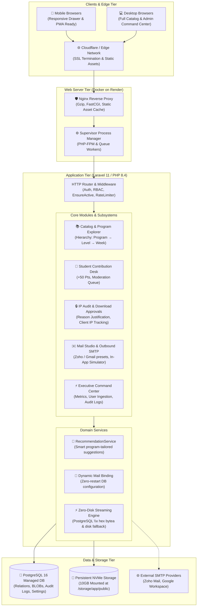
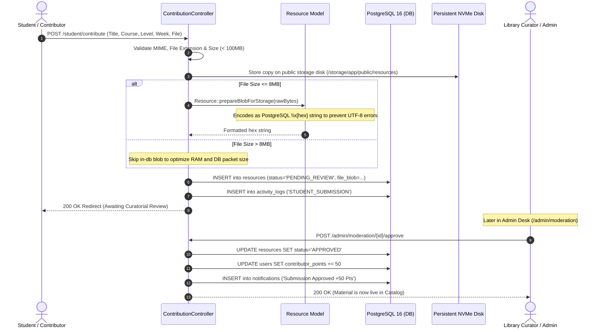
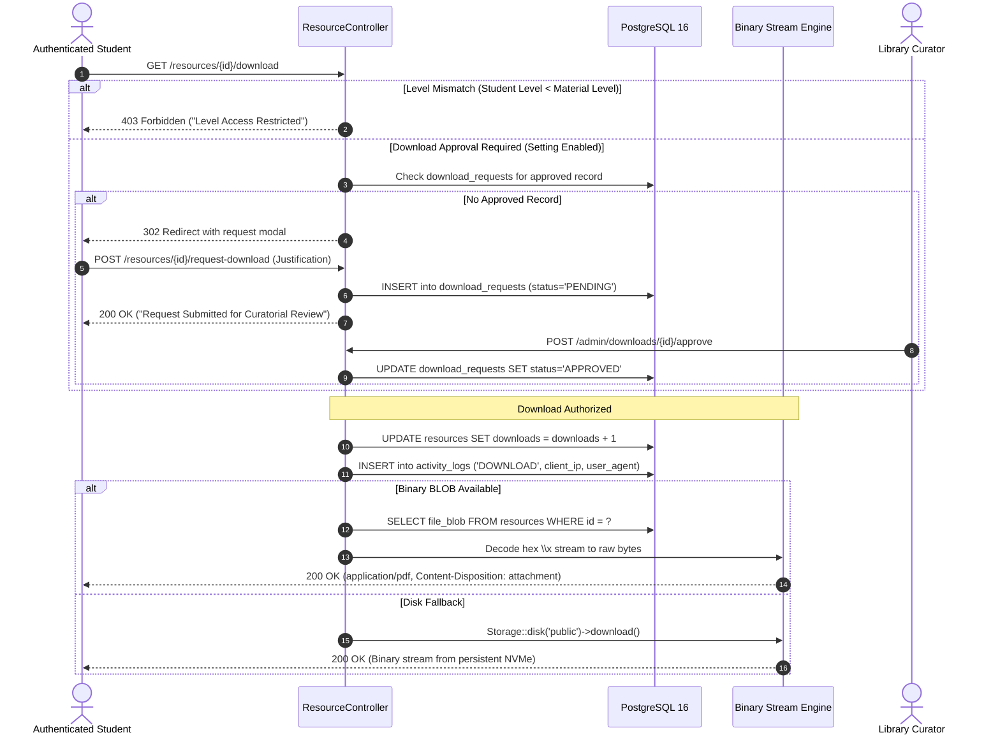
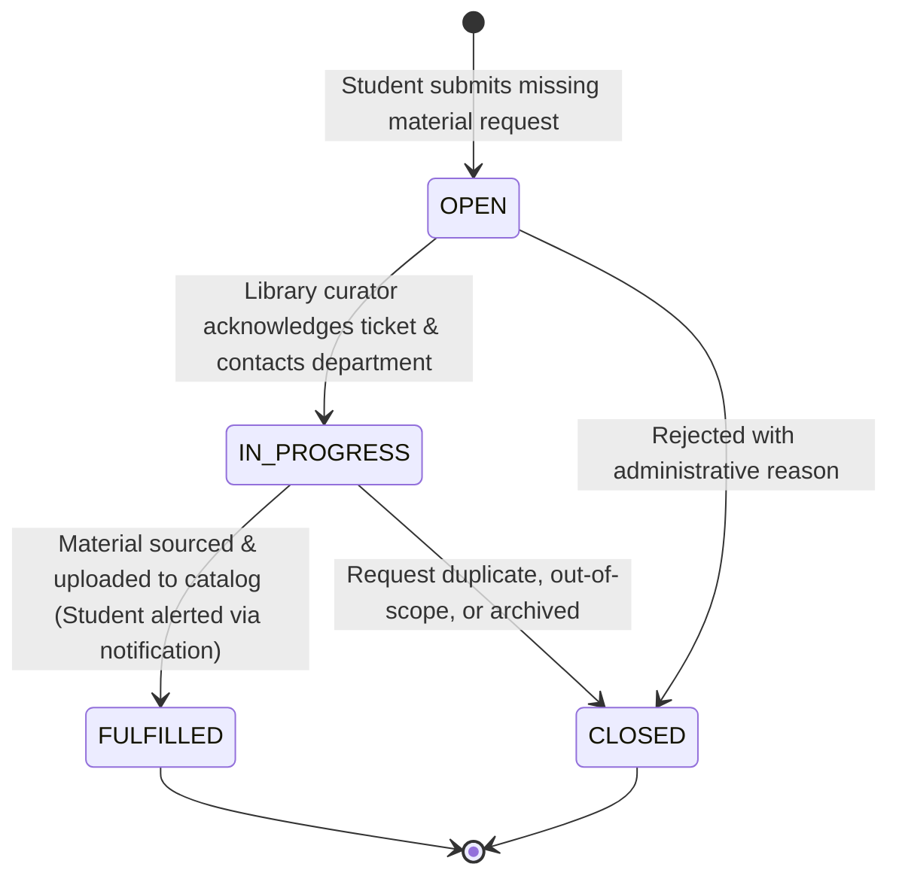
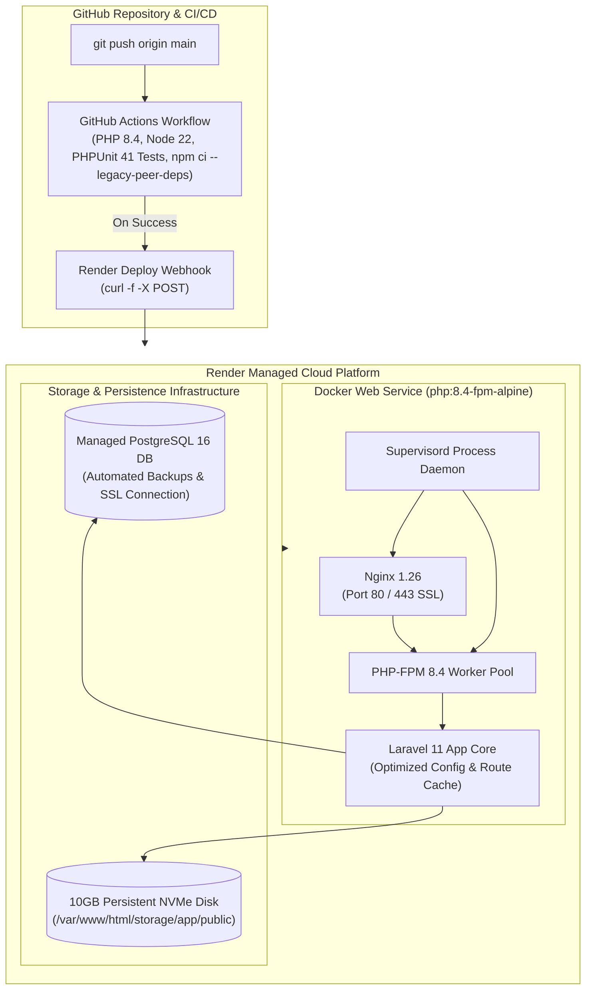

# Architecture Overview — UEW School of Business Digital Library

The **UEW School of Business Digital Library Management System** is an enterprise-grade academic learning and resource distribution repository built for the University of Education, Winneba (UEW), Faculty of Business Education.

The system is built as a robust, resilient Laravel 11/12 application using **Tailwind CSS v4**, **Alpine.js v3**, **PostgreSQL 16**, and multi-stage containerized deployments on **Render**.

---

## 1. High-Level System Architecture

The application adopts a modular Model-View-Controller (MVC) pattern with dedicated service domains, high-performance binary streaming capabilities, automated IP compliance auditing, and role-based access control.



---

## 2. Role-Based Access Control (RBAC) Architecture

The application enforces a strictly partitioned 5-tier access hierarchy:

```mermaid
flowchart TD
    Guest["👤 Guest Scholar / Visitor\n(Public Access)"]
    Student["🎓 Enrolled Student (Tier 1)\n(Level-Gated Access)"]
    Lecturer["👨‍🏫 Lecturer / Academic Staff (Tier 2)\n(Direct Resource Publishing)"]
    Staff["🏛️ Library Curator / Staff (Tier 3)\n(Moderation & Material Requests)"]
    Admin["⚙️ System Administrator (Tier 4)\n(Users, Settings, SMTP, Broadcasts)"]
    SuperAdmin["👑 Super Administrator (Tier 5)\n(Full Institutional Governance)"]

    Guest -->|Self-Registration & Index No.| Student
    Student -->|Browse L100-PhD, Stream Slides, Request Missing Materials| Student
    Student -->|Submit Lecture Slides & Past Questions| ContribQueue["Moderation Desk"]
    
    Lecturer -->|Publish Course Material Direct (Bypass Queue)| Catalog["Approved Catalog"]
    
    Staff -->|Review Submissions, Approve/Reject, Handle Requests| ContribQueue
    ContribQueue -->|Approved (+50 Pts)| Catalog

    Admin -->|Manage All Resources, Audit Logs, Ingest CSV Users, Send Broadcasts| Platform["Platform Core"]
    SuperAdmin -->|Manage Roles, Reset SMTP, Clear Caches, Manage RBAC| Platform
```

### RBAC Capabilities Matrix

| Privilege / Capability | Guest | Student | Lecturer | Staff | Admin | SuperAdmin |
|---|:---:|:---:|:---:|:---:|:---:|:---:|
| Browse Public Programs Directory (`/programs`) | ✅ | ✅ | ✅ | ✅ | ✅ | ✅ |
| Read Official Documentation (`/docs`) | ✅ | ✅ | ✅ | ✅ | ✅ | ✅ |
| Access Level-Gated Catalog Explorer (`/dashboard`) | ❌ | ✅ | ✅ | ✅ | ✅ | ✅ |
| Download Material (Subject to Level & IP Audit) | ❌ | ✅ | ✅ | ✅ | ✅ | ✅ |
| Submit Materials for Moderation Desk | ❌ | ✅ | ✅ | ✅ | ✅ | ✅ |
| Direct Unmoderated Uploads | ❌ | ❌ | ✅ | ✅ | ✅ | ✅ |
| Review & Moderate Student Submissions | ❌ | ❌ | ❌ | ✅ | ✅ | ✅ |
| Approve / Decline Download Requests | ❌ | ❌ | ❌ | ✅ | ✅ | ✅ |
| Send Departmental Broadcast Alerts & HTML Emails | ❌ | ❌ | ❌ | ❌ | ✅ | ✅ |
| Configure Dynamic SMTP & Cache Operations | ❌ | ❌ | ❌ | ❌ | ✅ | ✅ |
| Bulk CSV User Ingestion & Role Assignment | ❌ | ❌ | ❌ | ❌ | ✅ | ✅ |

---

## 3. Resource Ingestion & Binary BLOB Flow

To guarantee high availability on cloud container environments (such as Render) where ephemeral filesystems can reset, the application supports a dual-layer persistence model: physical storage disk and raw PostgreSQL binary `bytea` streaming.



---

## 4. Download Authorization & IP Compliance Audit Flow

When intellectual property safeguards (`require_download_approval`) are enabled, students must provide a legitimate study justification before downloading sensitive materials. Every download event logs the client's public IP address, user-agent, and academic affiliation.



---

## 5. Material Request Lifecycle

Students can petition the library faculty for missing lecture slides, syllabus modules, or exam archives through the Support & Request Desk (`/requests`).



---

## 6. Real-Time Dynamic SMTP & Email Studio Architecture

The application avoids brittle `.env` restarts for institutional communication by supporting real-time database-driven mail transport reconfiguration:

```mermaid
flowchart LR
    subgraph AdminActions["Administrative Control"]
        SettingsUI["⚙️ System Settings\n(/admin/settings)"]
        PresetSelect["Preset Quick-Switch\n(Zoho / Gmail / Log)"]
        TestPing["📡 Ping SMTP Diagnostic"]
    end

    subgraph DBConfig["Database Key-Value Store"]
        SettingsTable[("`settings` table\n(mail_mailer, mail_host,\nmail_port, mail_username,\nmail_password, mail_encryption)")]
    end

    subgraph ServiceEngine["Mail Execution Engine"]
        BootHook["AppServiceProvider::boot()\nConfig::set('mail.mailers.smtp')"]
        EmailStudio["✉️ Mail Studio & Simulator\n(/admin/mail-studio)"]
        FallbackArchive["📥 In-App Mailbox Archive\n(Local simulation & fallback)"]
    end

    subgraph ExternalDispatches["External Transmission"]
        ZohoServer["Zoho SMTP\n(smtppro.zoho.com:465 SSL)"]
        GoogleServer["Google Workspace\n(smtp.gmail.com:587 TLS)"]
    end

    SettingsUI -->|Save Host & Masked Keys| DBConfig
    PresetSelect -->|1-Click Configuration| DBConfig
    TestPing --> ServiceEngine
    DBConfig --> BootHook
    BootHook --> ServiceEngine
    EmailStudio -->|Simulate Inbound/Outbound| FallbackArchive
    ServiceEngine -->|Direct Dispatch| ZohoServer
    ServiceEngine -->|Direct Dispatch| GoogleServer
    ServiceEngine -.->|On Socket Timeout / Block| FallbackArchive
```

---

## 7. Containerization & Deployment Topology on Render

The system is encapsulated in a production-hardened multi-stage Docker container deployed to Render alongside a managed PostgreSQL 16 cluster and persistent NVMe volume:



---

## 8. Directory & Codebase Architecture

```
digital-library-management-system-backend/
├── app/
│   ├── Http/
│   │   ├── Controllers/
│   │   │   ├── Admin/              # Administrative Controllers (11 desks)
│   │   │   │   ├── BroadcastController.php
│   │   │   │   ├── CategoryController.php
│   │   │   │   ├── DashboardController.php
│   │   │   │   ├── DownloadApprovalController.php
│   │   │   │   ├── MailTestController.php
│   │   │   │   ├── ModerationController.php
│   │   │   │   ├── ReportController.php
│   │   │   │   ├── ResourceController.php
│   │   │   │   ├── SettingsController.php
│   │   │   │   ├── UserController.php
│   │   │   │   └── UserImportController.php
│   │   │   ├── Auth/               # Authentication & Onboarding
│   │   │   ├── Student/            # Study Hub & Material Contribution
│   │   │   ├── BookmarkController.php
│   │   │   ├── DashboardController.php
│   │   │   ├── HomeController.php
│   │   │   ├── MaterialRequestController.php
│   │   │   ├── NotificationController.php
│   │   │   ├── ProfileController.php
│   │   │   ├── ResourceController.php
│   │   │   └── ReviewController.php
│   │   └── Middleware/
│   │       ├── AdminMiddleware.php # RBAC: Staff, Admin, SuperAdmin guard
│   │       └── EnsureActive.php    # Session kill-switch for deactivated users
│   ├── Mail/                       # Institutional Mailable Classes
│   │   ├── AdminBroadcastMail.php
│   │   ├── SecurityAlertMail.php
│   │   └── WelcomeActivationMail.php
│   ├── Models/                     # Eloquent Entities (11 Models)
│   │   ├── ActivityLog.php
│   │   ├── Bookmark.php
│   │   ├── Category.php
│   │   ├── DownloadRequest.php
│   │   ├── EmailLog.php
│   │   ├── MaterialRequest.php
│   │   ├── Notification.php
│   │   ├── Resource.php
│   │   ├── Review.php
│   │   ├── Setting.php
│   │   └── User.php
│   └── Services/                   # Domain Logic Services
│       └── RecommendationService.php
├── database/
│   ├── migrations/                 # 14 Schema Migrations
│   └── seeders/                    # Realistic Institutional Seed Data
├── deploy/
│   ├── docker/                     # Nginx, Supervisor & PHP configs
│   └── Dockerfile                  # Multi-stage production container
├── docs/                           # Exhaustive Architectural Documentation
├── resources/
│   ├── css/app.css                 # Tailwind CSS v4 Theme & Tokens
│   ├── js/app.js                   # Alpine.js v3 Initialization
│   └── views/                      # Modern Blade Templates (5 Layouts + Subsystems)
├── routes/
│   ├── web.php                     # Complete Route Definitions & Middleware Gates
│   └── console.php
└── tests/                          # 41 Automated Feature & Unit Test Suites
```

---

&copy; University of Education, Winneba &mdash; School of Business. All rights reserved.
