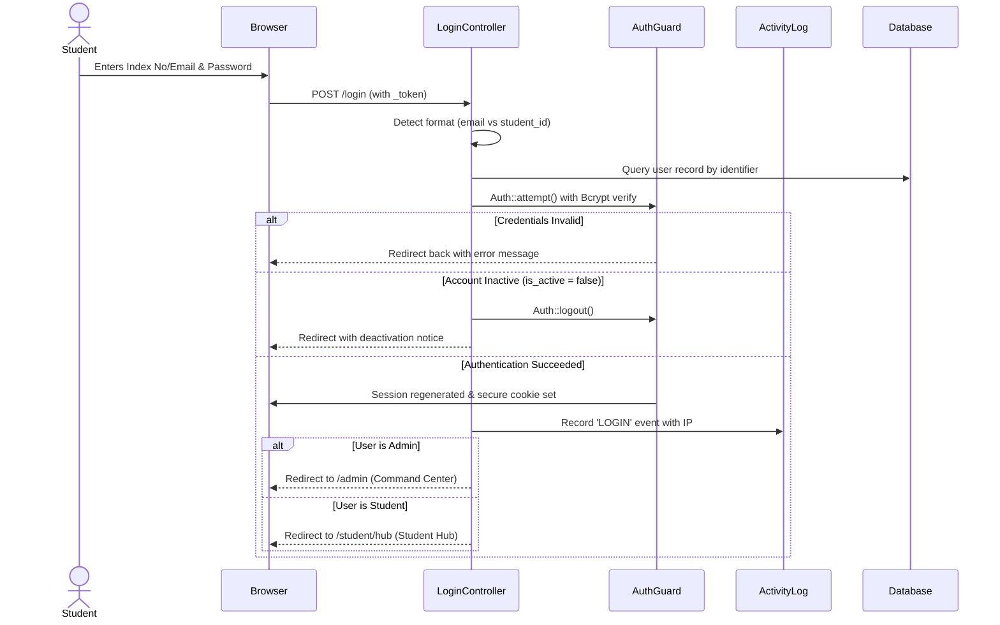

# Authentication & Authorization Flows: UEW Digital Library

## 1. Authentication Overview

The system uses standard Laravel Session-based State-Cookie Authentication coupled with cryptographically secure CSRF protection, eliminating local storage token exposure.

### Primary Capabilities:
- **Dual Login Identifier**: Students can sign in using their **Student Index Number** (e.g., `5201040001`) or their institutional **Email Address** (`student@st.uew.edu.gh`).
- **Account Status Guard**: [`EnsureActive`](file:///c:/Users/user/Desktop/digital-library-management-system-backend/app/Http/Middleware/EnsureActive.php) immediately intercepts and revokes sessions if an administrator deactivates an account.
- **Smart Post-Login Redirection**:
  - Administrators & Superadmins &rarr; [`/admin`](file:///c:/Users/user/Desktop/digital-library-management-system-backend/routes/web.php) (Command Center).
  - Students &rarr; [`/student/hub`](file:///c:/Users/user/Desktop/digital-library-management-system-backend/routes/web.php) (Personalized Student Hub).

---

## 2. Authentication Sequence Flow

---

## 3. Password Recovery Flow
- Accessible at `/forgot-password`.
- Uses signed tokens generated via Laravel's password broker and stored in `password_reset_tokens`.
- Delivers password reset notifications using the configured mail driver (Mailpit in development, SMTP in production).
