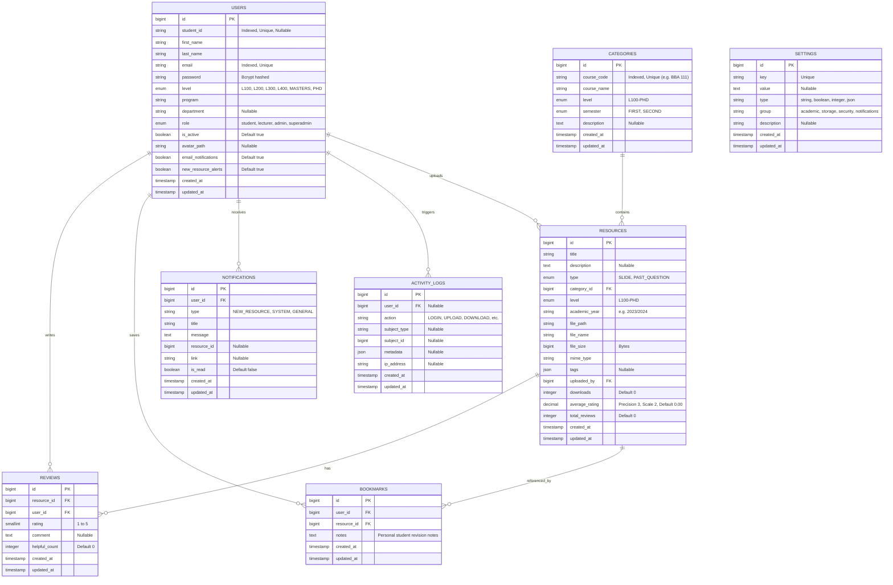

# Database Schema: UEW Digital Library Management System

## 1. Relational Entity Relationship Diagram (ERD)

---

## 2. Table Specifications & Indexes

### `users`
- **Unique Indexes**: `users_email_unique`, `users_student_id_unique`.
- **Role Hierarchy**: `superadmin` > `admin` > `lecturer` > `student`.

### `categories`
- **Unique Indexes**: `categories_course_code_unique`.
- **Foreign Constraints**: Referenced by `resources.category_id` (`ON DELETE RESTRICT`).

### `resources`
- **Rating Synchronization**: Automatically updated by Eloquent `Review::saved` and `Review::deleted` events, maintaining cached `average_rating` and `total_reviews` columns to eliminate costly runtime SQL aggregation on catalog listings.

### `settings`
- Caches all operational values in memory via `Cache::rememberForever()`, invalidated on any `Setting::set()` call.
