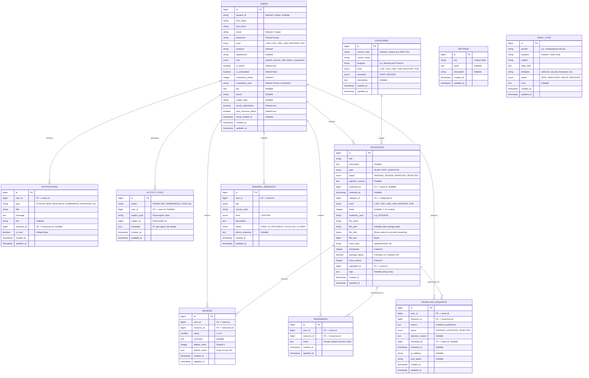

# Database Schema & Entity Relationship Model — UEW Digital Library

The **UEW School of Business Digital Library Management System** utilizes a high-integrity relational database schema designed for multi-tenant academic level segregation, high-throughput binary content streaming, and strict intellectual property audit logging.

The database runs on **PostgreSQL 16** in production (Render) and supports **SQLite 3** for local unit and feature test execution.

---

## 1. Relational Entity Relationship Diagram (ERD)

---

## 2. Table Specifications & Indexes

### `users`
- **Primary Key**: `id` (`BIGINT UNSIGNED AUTO_INCREMENT`)
- **Indexes**:
  - `email` (UNIQUE)
  - `student_id` (UNIQUE, NULLABLE)
  - `level`, `program`, `role` (B-Tree indexes for fast student filtering)
- **Casts**: `is_active` (boolean), `is_onboarded` (boolean), `contributor_points` (integer), `email_verified_at` (datetime).

### `categories`
- **Primary Key**: `id` (`BIGINT UNSIGNED AUTO_INCREMENT`)
- **Indexes**:
  - `course_code` (UNIQUE, e.g. `BBA 111`, `BNF 211`, `BIS 311`)
  - `level`, `semester`, `program` (B-Tree indexes for curriculum drill-down)

### `resources`
- **Primary Key**: `id` (`BIGINT UNSIGNED AUTO_INCREMENT`)
- **Indexes**:
  - `category_id` (FK to `categories.id`)
  - `uploaded_by` (FK to `users.id`)
  - `status`, `level`, `type`, `week` (Composite & standalone indexes for high-speed faceted search)
- **Binary Data Handling (`file_blob`)**:
  - PostgreSQL uses the native `bytea` binary column type.
  - Raw binary strings are hex-encoded as `\x[hex]` upon insertion via `Resource::prepareBlobForStorage()`.
  - Streamed out directly via `Resource::getRawBlob()`.
  - `file_blob` is included in the model's `$hidden` attribute to ensure it is never serialized into JSON responses, preventing PHP memory exhaustion and `JsonException`.

### `download_requests`
- **Primary Key**: `id` (`BIGINT UNSIGNED AUTO_INCREMENT`)
- **Indexes**:
  - `user_id` + `resource_id` (Composite index for status lookups)
  - `status` (B-Tree index for the Admin Approvals Desk)

### `material_requests`
- **Primary Key**: `id` (`BIGINT UNSIGNED AUTO_INCREMENT`)
- **Indexes**:
  - `user_id` (FK to `users.id`)
  - `status` (B-Tree index for ticket workflow management)

### `email_logs`
- **Primary Key**: `id` (`BIGINT UNSIGNED AUTO_INCREMENT`)
- **Indexes**:
  - `recipient`, `status`, `created_at` (B-Tree indexes for Mail Studio filtering and diagnostics)

---

&copy; University of Education, Winneba &mdash; School of Business.
