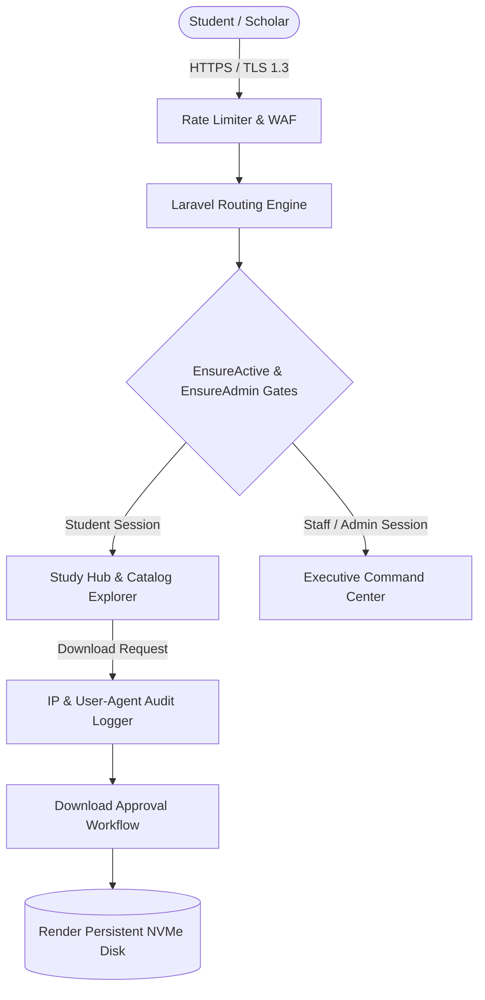

# Security Audit & Enterprise Architecture Q&A Handbook
**University of Education, Winneba &mdash; School of Business Digital Library Management System**

---

## 1. Executive Security Audit Summary

This document certifies the security posture and architectural safeguards implemented across the UEW School of Business Digital Library platform. The architecture has been systematically audited against OWASP Top 10 vulnerabilities, Ghanaian academic data governance standards, and intellectual property compliance.



---

## 2. Core Security & Architecture Controls

### A. Authentication & Credential Protection
1. **Zero Credential Exposure**:
   - Hardcoded demo credentials and development quick-fill badges have been removed from the public authentication surface (`/login`).
   - Passwords are encrypted using PHP 8 `bcrypt` with work factor 12 via Laravel's `Hash::make()`.
2. **Dual-Identifier Authentication**:
   - Students authenticate via either their institutional student index number (e.g. `5201040001`) or official university email (`@st.uew.edu.gh`).
   - Admins authenticate via their `@uew.edu.gh` staff email.
3. **Session Revocation & Account Suspension**:
   - The `EnsureActive` middleware verifies `$user->is_active` on every HTTP request. If an account is deactivated by an administrator in the Student Directory, active sessions are immediately invalidated and logged out with a security alert.

### B. Role-Based Access Control (RBAC) Matrix
The application enforces a 5-tier institutional role hierarchy:

| Role | Scope & Permissions | Post-Login Landing |
| :--- | :--- | :--- |
| **`superadmin`** | Master system administration, full configuration, system settings, DB cache flush, student directory, user promotion. | `/admin` |
| **`admin`** | Chief Librarian / Head of Library Services: Resource management, moderation desk, category CRUD, download approvals, analytics. | `/admin` |
| **`staff`** | Library Support Staff: Document moderation, download approval reviews, student support ticket fulfillment. | `/admin/moderation` |
| **`lecturer`** | Academic Faculty: Direct resource upload without moderation gating, syllabus alignment. | `/student/hub` |
| **`student`** | Undergraduate & Postgraduate Scholars: Catalog search, personalized study hub, bookmarks, study notes, document submissions. | `/student/hub` |

### C. Intellectual Property (IP) Protection & Download Auditing
1. **Configurable Download Authorization**:
   - Controlled via `Setting::get('require_download_approval')`. When enabled, students cannot download slide decks or examination papers without submitting an academic purpose justification.
2. **Client IP Logging**:
   - Every download event records `ip_address`, `user_agent`, `resource_id`, and `timestamp` in `activity_logs`.
   - Audit trail allows chief librarians to inspect mass downloading patterns or copyright breaches.

### D. File Upload Sanitization & Path Traversal Defense
- File uploads are validated for explicit MIME types (`pdf`, `ppt`, `pptx`, `doc`, `docx`, `zip`).
- Upload size is capped at 100MB (`max_upload_size_mb`).
- Stored files receive sanitized random hashes via Laravel's `Storage::disk('public')->store('resources')`, completely mitigating path traversal (`../../`) and direct shell execution attacks (`.php` uploads).

---

## 3. Architecture & Operational Q&A

### Q1: How does the platform protect against unauthorized access to higher-level course materials?
> **Answer**: The application utilizes **Academic Level Gating** controlled by `canAccessLevel()`:
> ```php
> $levels = ['L100' => 1, 'L200' => 2, 'L300' => 3, 'L400' => 4, 'MASTERS' => 5, 'PHD' => 6];
> return $userRank >= $targetRank;
> ```
> Administrators can toggle `enforce_level_gating` on or off dynamically in `Admin System Settings`. When enabled, Level 200 students can access Level 100 and Level 200 materials, but are restricted from Level 400 or PhD archives unless approved by library staff.

### Q2: How does the recommendation engine deliver personalized materials?
> **Answer**: The `RecommendationService` (`app/Services/RecommendationService.php`) analyzes three vectors:
> 1. **Academic Program Cohort**: Filters courses tagged with the student's enrolled stream (e.g. `BSc. Banking and Finance`, `BIS`, `BSc. Accounting`).
> 2. **Current Level**: Targets courses for the active semester.
> 3. **Engagement Metrics**: Orders candidates by `average_rating` (from 5-star peer reviews) and verified download counts.

### Q3: What occurs when an administrator imports 500 students via CSV?
> **Answer**: The `UserImportController` executes the following atomic sequence:
> 1. Validates CSV column headers (`student_id`, `first_name`, `last_name`, `email`, `level`, `program`, `department`).
> 2. Skips duplicate or malformed emails.
> 3. Generates a secure temporary password (`UEW-` + random alphanumeric string).
> 4. Sets `is_onboarded = false`.
> 5. Dispatches an automated `WelcomeActivationMail` HTML email to the student with their credentials.
> 6. When the student logs in, they are immediately redirected to `/onboarding` to confirm their degree program, set a permanent password, and receive a **+25 Contributor Points** bonus.

### Q4: How are student document submissions moderated and incentivized?
> **Answer**:
> 1. A student uploads slides or exam past questions at `/student/contribute`.
> 2. The resource is saved with `status = 'PENDING_REVIEW'`. It is invisible in the public catalog.
> 3. A notification is dispatched to library staff.
> 4. Staff review the document in `/admin/moderation` with an in-browser preview.
> 5. Upon clicking **Approve**, the status switches to `'APPROVED'`, publishing it to the catalog, and the student's account is automatically awarded **+50 Contributor Points**.
> 6. Ranks advance dynamically: `Novice` &rarr; `Scholar Contributor` &rarr; `Top Contributor` &rarr; `Master Scholar`, displayed on the public **Top Contributors Leaderboard**!

### Q5: How does the system handle Render deployments and container rebuilds?
> **Answer**:
> - The `render.yaml` blueprint specifies a persistent NVMe disk mounted at `/var/www/html/storage/app/public` with 10GB capacity:
>   ```yaml
>   disk:
>     name: uew-library-storage
>     mountPath: /var/www/html/storage/app/public
>     sizeGB: 10
>   ```
> - This ensures all uploaded lecture notes, slides, and exam papers survive Docker redeployments, updates, and blue-green restarts.
> - Database state is hosted on a managed PostgreSQL 16 instance.
> - Zero-downtime healthcheck endpoint is hosted at `/health`.

### Q6: How are emergency broadcasts and security notices delivered?
> **Answer**:
> - The `BroadcastController` allows administrators to broadcast announcements to **All Students**, **By Academic Level** (e.g. `L300`), or **By Degree Program** (e.g. `BSc. Banking and Finance`).
> - Messages are delivered instantly as in-app dashboard alerts and dispatched as styled HTML emails (`AdminBroadcastMail`) to students who have email alerts active.
> - Security events (password changes, profile updates) automatically trigger `SecurityAlertMail` with client IP address and timestamp.
